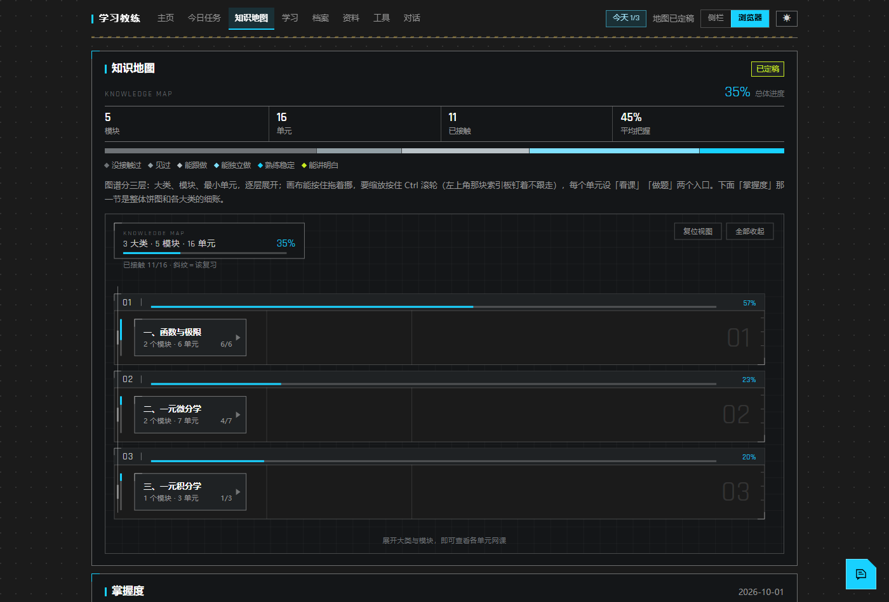
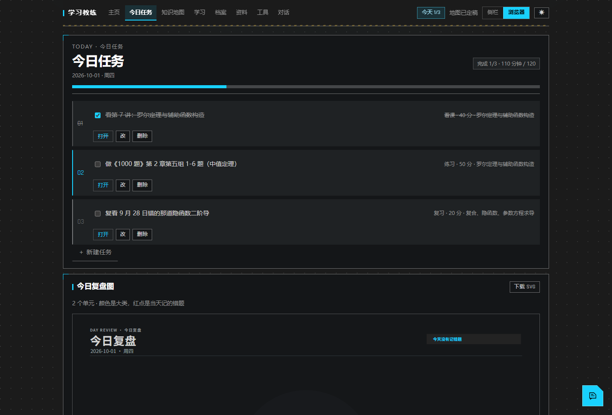
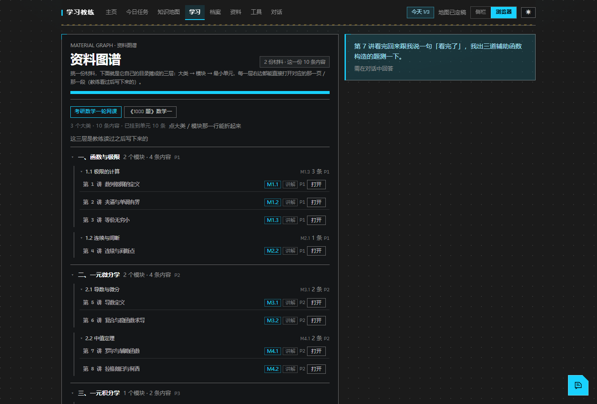
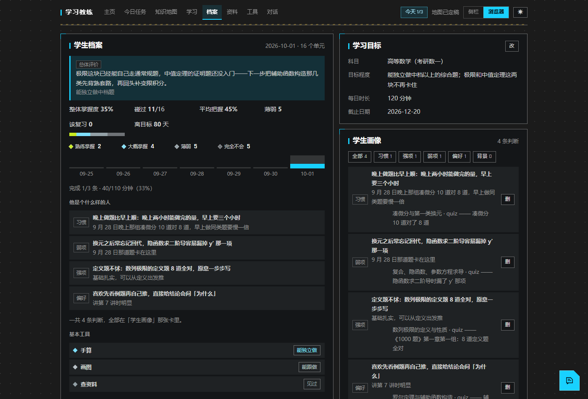

# dsh-study-coach

[](https://github.com/Ame-Choo/dsh-study-coach/actions/workflows/ci.yml)


**DSH 的学习教练插件。** 给 DSH 加一个「学习教练」模式的会话，外加一个挂在 `/study` 的网页面板：
把一门课拆成知识地图，逐单元记掌握度、排每天的任务，学生看得见自己在往哪走、下一步动哪儿。



<table>
<tr>
<td width="50%"></td>
<td width="50%"></td>
</tr>
<tr>
<td><b>今日任务</b>：今天几条活儿，落到具体那一讲、那一组题；做完勾掉，能改能删。</td>
<td><b>资料图谱</b>：按材料自己的目录摊三层，每一条内容都挂着打开那一页 / 那一讲的链接。</td>
</tr>
<tr>
<td colspan="2"></td>
</tr>
<tr>
<td colspan="2"><b>档案页</b>：总评、四层掌握度、七天节奏、学生画像、基本工具、错题；每一条判断都挂着它引的那次证据。</td>
</tr>
</table>

## 它是什么

一个插件是两半：

| | |
| --- | --- |
| **对话那半** | 一个叫「学习教练」的 agent 预设，加随包的工作法 `skills/study-coach/SKILL.md`，加 21 个 `study_*` 工具。**学习内容全在对话里写**：学习目标、知识地图、材料分析、掌握度证据、错题、每日任务。 |
| **网页那半** | 挂在 DSH 自己 web 服务器上的面板（`/study`，八页）。学生只在面板上看和点：今天做什么、进度到哪、哪个单元薄弱、该复习什么，点一下就打开那一节网课 / 那份练习的那一页。 |

**这个仓库里只有代码，一条学习内容都没有。** 目标、地图、掌握度、任务、材料清单全是数据，落在本机的数据根目录里
（默认 `~/.dsh/study-coach/`）：卸载、升级、重装都不会动它，换地方就设环境变量 `DSH_STUDY_ROOT`。
一个**学习目标**一份档案目录，所以同一台机器上可以同时学几门课，各有各的地图、掌握度和任务表。

## 装完你会得到什么

### 面板八页

| 页 | 里面是什么 |
| --- | --- |
| 主页 | 教练的指引：现在该回对话里做什么 |
| 今日任务 | 今天几条活儿——看哪一讲、做哪几题、复习哪条错题，每条带「打开」，能勾完成 / 改 / 删。下面是今日复盘图，可以单独下载成 SVG |
| 知识地图 | 大类 → 模块 → 最小单元三层，逐层展开；画布能按住拖着挪，Ctrl／⌘ + 滚轮缩放。每个单元两颗按钮：**看课**（自动落到那一讲的文件上）、**做题**（把教练叫来，按你的档案挑材料页码与题号） |
| 学习 | 资料图谱：一份材料按它自己的目录摊三层，每一层右边都是能直接打开对应那一段的链接 |
| 档案 | 综合学生档案（总体评价、四层掌握度、七天节奏、学生画像、基本工具、错题）+ 学习目标 + 学生画像；每个大类 / 模块 / 单元后面一颗「档案」按钮看那一级的细账 |
| 资料 | 材料登记表、导入（拖 PDF 进来或者粘本机路径）、AI 出题的入口 |
| 工具 | 番茄钟、记忆卡（按艾宾浩斯那套间隔回来）、清单 |
| 对话 | 整页一个聊天窗口，顶上能选 DSH 里哪个学习会话；右下角一颗悬浮窗，随时能把话塞给教练 |

顶上还有一张**体检卡**，把「现在最该动哪儿」分三档（挡路的 / 该修的 / 顺手能做的），每条说清为什么、配一颗跳转按钮
——比如「地图还是草稿，没念给学生确认过」「2 份材料登记了但没通读」「16 个单元还没挂练习材料」。

### 对话里能干什么

21 个 `study_*` 工具，每一条都写清「什么时候调、参数从哪儿拿、返回怎么读、跟别的工具什么顺序」：

| 用途 | 工具 |
| --- | --- |
| 看全貌 | `study_report`（目标、地图、掌握度、今日任务 + 面板地址） |
| 目标 | `study_goal`、`study_library`（新建 / 切换 / 改名 / 删档案） |
| 知识地图 | `study_map`（`set` 整份 / `append` 追加模块 / `confirm` 定稿；三层，最小单元就是一节网课，挂 `video` 与 `practice`） |
| 材料 | `study_material`（教辅 / 网课 / 讲义 / 真题 / AI 出题）、`study_analysis`（通读结论：教学定位、每章范围、例题习题、难度）、`study_files`（列目录、拿链接） |
| 拆到页 | `study_pages`（扫描版 PDF 渲某几页成图，用来认页码）、`study_book`（整本拆成页级索引，`pages` 查某个单元在哪几本教辅的哪几页） |
| 掌握度 | `study_record`（记一条证据、推进状态）、`study_archive`（某一级的细账）、`study_ability`（总体能力 / 一句判词）、`study_tool_level`（基本工具） |
| 错题 | `study_mistakes`（读）、`study_record` 带 `mistake`（记） |
| 任务与清单 | `study_plan`（排每日任务）、`study_todo`（学生自己想办的事）、`study_focus`（番茄钟） |
| 记忆卡 | `study_card`（加 / 该背了 / 记一次复习 / 改 / 删） |
| 学生 | `study_student`（画像：一句一条结论，**必须挂证据**） |
| 面板 | `study_guide`（面板顶上放一句指引）、`study_inbox`（读学生的留言） |

### 教练的工作法随包发

`skills/study-coach/SKILL.md` 是 agent 一装就有的工作法：**布置作业之前先过三关**（他现在在哪儿 / 他到底需要什么 /
哪份材料的哪一段派什么用场）；**材料登记完先通读一遍**，结论写进 `study_analysis`，画地图和排任务都从这份结论里取；
收完作业、听完课，掌握度档案与总体评价一起更新。

### 掌握度怎么记

六档：`没接触过 / 见过 / 能跟做 / 能独立做 / 熟练稳定 / 能讲明白`，一次只推进一档。
往「能独立做」以上推要有**真做过**的证据（做题、作业照片），不够就挡回去，并说清现在有几条、还差几条。
证据不是分数，是「哪次自评、哪道题、哪张照片」，可追溯；错题本挂在证据上，不新开一张表。
大类、模块、最小单元各有一条四层掌握度，档案页另有一张整体饼图。

## 安装

先决条件：DSH `>= 0.2.0-rc.1`，Node `>= 22.13.0`。

### 一、插件市场（最省事）

DSH 里装了插件市场（`dshmarket`）的话，打开搜 `study-coach` 点安装。

### 二、让对话里的 agent 装

直接跟 DSH 说「装一下 `dsh-study-coach` 这个插件」——agent 有 `plugin_manager` 的 `install_bundle`，装完会告诉你结果。

### 三、命令行

在**你自己的 profile 目录**里装（不是这个仓库）：

```bash
cd ~/.dsh/profiles/desktop        # 或者你的 profile 名
pnpm add dsh-study-coach          # 已发 npm 时
pnpm add github:<你>/dsh-study-coach   # 走 GitHub，没发 npm 也行
```

然后把包名加进 profile `package.json` 的 `dsh.profile.bundles` 数组：

```json
"dsh": { "profile": { "bundles": ["dsh-study-coach"] } }
```

### 四、本地源码（改代码不用发版）

```bash
cd ~/.dsh/profiles/desktop
pnpm add link:/绝对路径/dsh-study-coach
```

同样把 `dsh-study-coach` 加进 `dsh.profile.bundles`。

### 装完要重启 DSH

插件的 HTTP 路由是**进程启动时**挂上去的，不重启不生效；数据不受重启影响。
判断「现在跑的到底是新的还是旧的」有两个自查脚本：`node scripts/check-live.mjs`（探一遍正在跑的 DSH）与
`node scripts/preview.mjs`（不用 DSH，直接把面板起在 19390）。

### 卸载

删掉 `dsh.profile.bundles` 里那一项、`pnpm remove dsh-study-coach` 即可。**学习数据不在插件里**，卸载、升级、
重装都不会动它。

## 快速上手

1. 在 DSH 里开一个「**学习教练**」模式的会话（面板的对话页那颗「＋ 新建」也能开）。
2. 说清四件事，它会把学习目标记下来：**学什么 / 要掌握到什么程度 / 每天能学多少分钟 / 最晚什么时候**。
   每天多少分钟决定它后面给你排多少活。
3. 把材料丢给它——教辅 PDF、网课目录文件夹、真题都行，说一句「读一遍」：它会登记、通读、把结论写下来，
   然后画一张知识地图念给你确认。

之后每天就是：面板上看今天要做什么 → 做完跟教练说一声（拍张作业照片也行）→ 它记证据、更新错题与本轮掌握度、
排明天的活。地图定稿之后别自己改单元号——掌握度挂在 id 上。

## 两个地址

- `http://127.0.0.1:19387/study` —— 挂在 DSH 自己的 web 服务上，同源。系统浏览器直接开。
- `http://127.0.0.1:19388/study` —— 插件自己起的独立端口（默认 19388，被占就往后挪一位）。
  DSH 内嵌 Browser 页签不许打开 DSH 自身的地址，只认这条。

两条地址是同一个 handler，接口路径完全一样，面板代码不用改。独立端口只监听 `127.0.0.1`，DSH 关掉它就跟着关。

## 数据放在哪

```
<数据根>/
├── registry.json          有哪几个学习目标、现在用哪个
├── profiles/<目标 id>/    一个学习目标一份，里面就是下面那几张表
│   ├── profile.json       学习目标、材料清单、基本工具、总体能力判词
│   ├── map.json           知识地图（大类 / 模块 / 最小单元，单元上挂着网课和练习的路径）
│   ├── mastery.json       每个知识点的状态、证据、错题、复习时间
│   ├── tasks.json         按日期分的每日任务
│   ├── analysis.json      每份材料通读之后的结论：教学定位、每章讲什么、例题习题范围、难度
│   ├── toolbox.json       番茄钟的当前状态 + 清单
│   ├── memory.json        记忆卡与它们的排期
│   ├── student.json       学生画像：一条条挂着证据的判断
│   ├── guide.json         面板顶上那句指引
│   └── inbox.json         学生在面板上留的话
├── trash/                 删掉的目标挪这儿，不是真删
└── scratch/pages/         拆页时渲出来的 PNG，过程产物，随时可清
```

写盘是「先写临时文件再改名」，中途断电不会留半个文件；读的时候 JSON 坏了会退回默认值而不是崩掉。

## 常见问题

- **改完代码什么时候生效？** `assets/*` 与 `lib/client.js` 刷新页面就见效；`lib/` 里其它文件和
  `package.json` 要**重启 DSH**。
- **面板里点「打开」打不开？** 不在已登记的材料范围内回 404；登记过、但盘上已经找不到（移动硬盘没插、
  网盘没挂）回 410，并说清是这种情况。
- **面板里只列出「学习教练」模式的会话**，这是有意的：它不是通用聊天窗，是这门课的教练。
- **一份材料点不出「第几页」？** 先让它读一遍（写进 `study_analysis`），或者用 `study_book` 把扫描版拆成页图，
  页码是从那儿认出来的。
- **学生自己在面板上能改什么？** 自评档位、勾 / 改 / 加今天任务、清单、记忆卡、切档案，以及在对话页跟教练说话。
  其余（目标、地图、材料、错题、画像、每天排什么）都由教练在对话里写。

## 还没做

- 拍照上传作业与自动批改（现在只能靠 `study_record` 的 `kind=photo` 记一条文字结论，图片本身进不了档案）。
- 摸底卷自动出题（现在是在对话里出，判完记 `study_record`）。
- 侧栏页签（走 `dsh-better-sidebar` 的 `registerTab`），现在面板只在自己那个端口上。
- 学生账号 / 多学生。现在一台机器一份档案根，多的是「一个学生多个学习目标」。

## 开发

要动代码，先翻 **[`DEV.md`](DEV.md)**：请求链路、数据落盘、加一条 API / 一个工具 / 一个面板子页面各要动哪几处、
测试 harness 怎么用、本地怎么验收、怎么发版、一页踩过的坑。这份 README 只讲这个插件是什么、怎么用。

```bash
git clone <仓库地址>
cd dsh-study-coach
npm install          # 只为拿到 @deepseek-ai/* 的宿主包，跑测试用
node --test          # 340 条
```

其它几份文档：更改动的来龙去脉看 [`NOTES.md`](NOTES.md)，不许怎么做看 [`AGENTS.md`](AGENTS.md)，
视觉规范看 [`design.md`](design.md)，发布流程看 [`PUBLISHING.md`](PUBLISHING.md)，版本历史看 [`CHANGELOG.md`](CHANGELOG.md)。

## License

MIT
